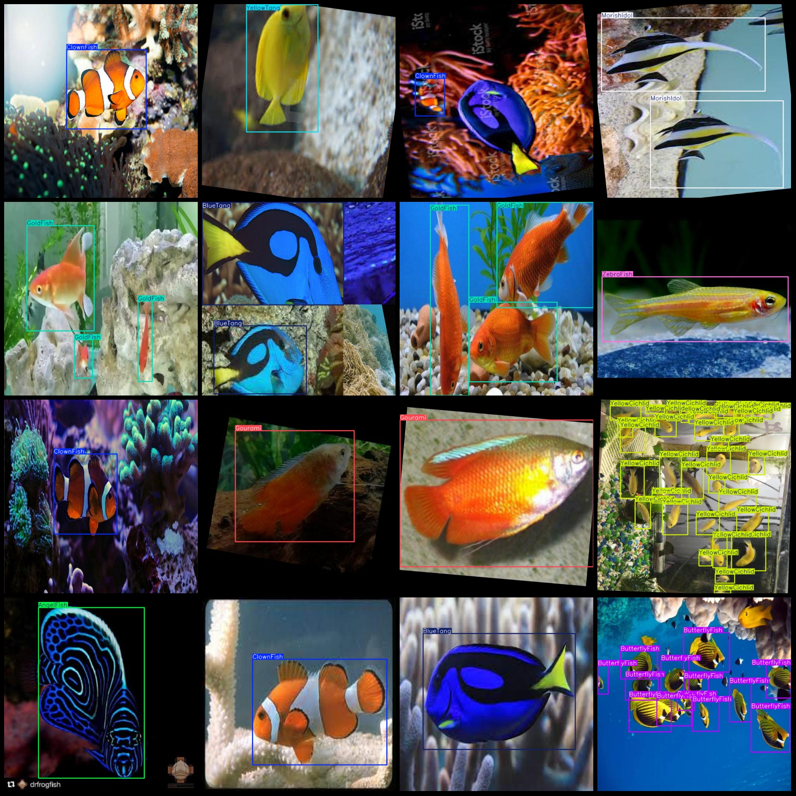

# 13 Different Fish Detection Dataset in VOC+YOLO Format with 7798 Images and 13 Categories

Dataset format: Pascal VOC format+YOLO format(without split path in txtfile, only contain jpgimage and corresponding VOC format.xmlfile and yolo format.txtfile)
Number of images (jpg file count): 7798
annotation count: 7798  
annotation count: 7798  
annotationnumber of classes: 13  
The labeled categories are: ["AngelFish", "BlueTang", "ButterflyFish", "ClownFish", "GoldFish", "Gourami", "MorishIdol", "PlatyFish", "RibbonedSweetlips", "ThreeStripedDamselfish", "YellowCichlid", "YellowTang", "ZebraFish"]
boxes per class:   
AngelFish box count = 770
BlueTang box count = 2006
ButterflyFish box count = 1300
ClownFish box count = 995
GoldFish box count = 1003
The number of Gourami frames is 1749.
MorishIdol box count = 356
Platyfish box count = 1090
RibbonedSweetlips box count = 590
ThreeStripedDamselfish box count = 826
YellowCichlid box count = 1171
YellowTang box count = 700
ZebraFish box count = 2069
total boxes: 14625  
image resolution: 640x640  
Image enhancement exists: Yes, there are about 4500 images that are original images, and the rest are enhanced images. The enhancement techniques include rotation enhancement.
Use the annotation tool: labelImg.
Annotation rule: Draw a rectangle around the class.
Important Notes: There are currently no notes.
Special Statement: This dataset does not guarantee the accuracy of the trained model or weight file.
Image Preview:
Annotation Example:
## Images

Here is a pay link on Stripe ( https://buy.stripe.com/3cs8yP7sY87d0vu9AB ). Please contact me lonlonago@foxmail.com after funding $89, and I will send you a complete data files , thank you!

